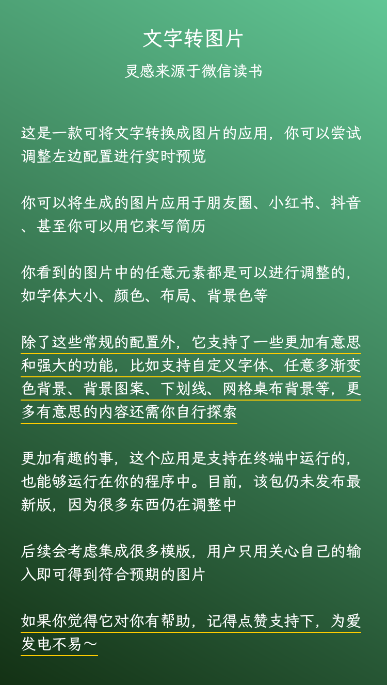
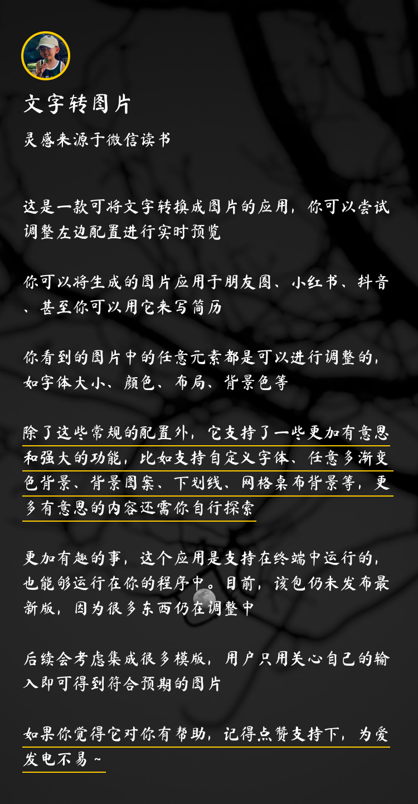

## 文字转图片

这是一个文字转图片的应用，原理是采用canvas绘制图片。如需了解具体核心的实现，可以前往[anyphoto](https://github.com/weirui88888/anyphoto)查看。该仓库仅仅是对核心功能的上层包装。

**推荐桌面端网页体验**，移动端正在思考如何布局更方便使用，目前计划是提供一些预设模板。方便用户直接体验，有兴趣的小伙伴可以提出自己的见解。

功能不断迭代中～

## 体验地址

[text2image](http://text2image.fun)

## 效果图

下方图片由该应用生成

## 支持的功能

调研了下，类似的工具已经有不少了，但是功能都比较单一。

下面列出它的一些核心优势

- 全量支持定制化，图片中的**任何元素都支持自定义**，比如颜色、字体、大小、间距、布局等
- 支持全局安装后通过终端调用，意味着你可以在自己的程序中接入（最新版尚未发布npm）
- 支持自定义字体、背景图案、多方向渐变色背景、桌布网格背景、支持自定义布局、支持下划线标记

## 接下来计划

- 提供预设模版，使用者只需要关心输入即可，无需自行调整配置
- 提供途径，供开发者上传满意的配置方案，他人可直接使用该模板
- 考虑如何降低使用者心智负担，应用虽然很强大，但也导致了配置项过多

## 更多

该应用的灵感来源于微信读书，如果你觉得它有价值，或者有更好的想法，欢迎参与进来

使用过程中的任何问题都可在[Issue](https://github.com/weirui88888/text2image-gui/issues)或[Discussion](https://github.com/weirui88888/text2image-gui/discussions/1)进行留言反馈

为爱发电不易，期待你点亮⭐️

微信联系方式：XdzD8b
